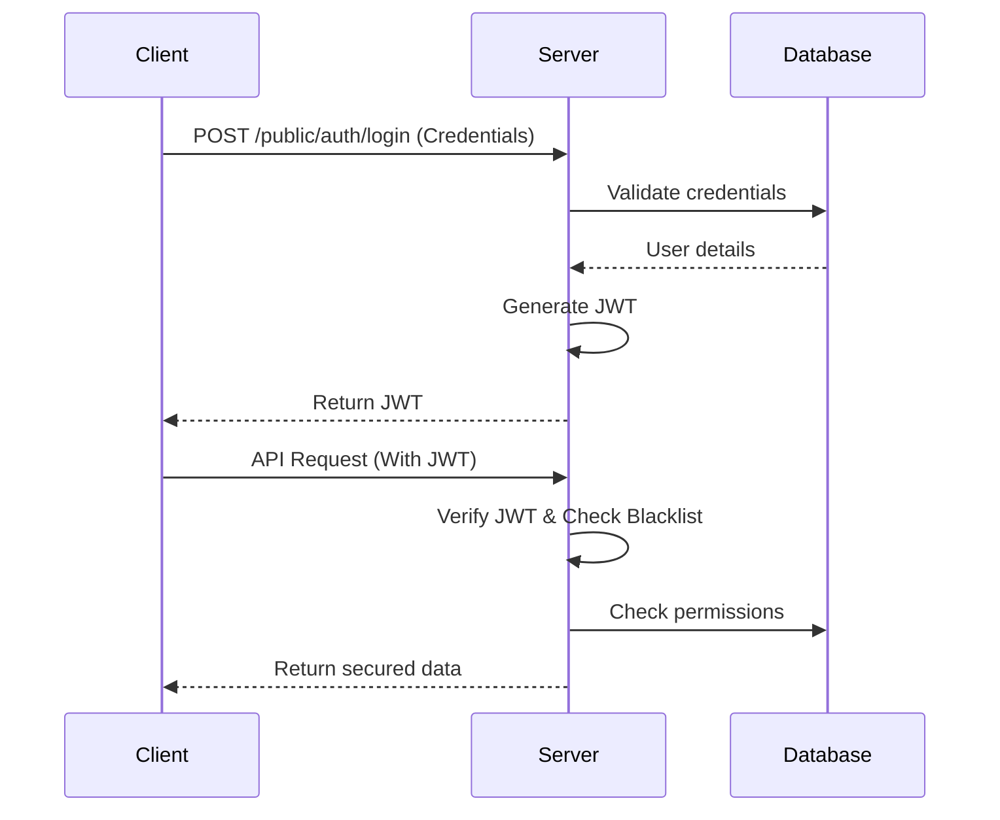

```markdown
# 🚢 Shipping System - Secure Authentication & Logistics Backend

[](https://openjdk.org/)
[](https://spring.io/projects/spring-boot)
[](https://www.postgresql.org/)
[](https://opensource.org/licenses/MIT)

A production-ready backend system for secure authentication and logistics management built with Spring Boot. Features JWT authentication, role-based access control, shipment tracking, and financial operations with comprehensive security measures.

## ✨ Key Features
- **🔒 Secure Authentication**: JWT-based auth with token invalidation
- **👥 User Management**: Registration, profile updates, password reset
- **🏢 Enterprise Support**: Dedicated enterprise endpoints
- **📍 Address Management**: Validated address operations
- **💰 Wallet System**: Balance tracking and transactions
- **📦 Shipment Tracking**: Full lifecycle management
- **✉️ Email Notifications**: Password resets and alerts
- **📊 Comprehensive Logging**: SLF4J with configurable levels
- **🐳 Containerized**: Docker support for PostgreSQL and app

## 🧩 Technology Stack
| Component           | Technology               |
|---------------------|--------------------------|
| Backend Framework   | Spring Boot 3.x          |
| Security            | Spring Security 6.x      |
| Database            | PostgreSQL 15+           |
| ORM                 | Spring Data JPA          |
| API Documentation   | OpenAPI 3.0              |
| Containerization    | Docker + Docker Compose  |
| Mapping             | MapStruct                |
| Testing             | JUnit 5, Mockito         |
| Build Tool          | Maven                    |

## 🚀 Quick Start
```bash
# Clone repository
git clone https://github.com/your-username/shipping-system.git
cd shipping-system

# Copy configuration
cp shipping/src/main/resources/application.properties.example \
   shipping/src/main/resources/application.properties

# Start services
docker-compose -f infrastructure/docker/docker-compose.yml up -d

# Build and run
cd shipping
mvn spring-boot:run
```
Access API at: `http://localhost:8080`

## ⚙️ Configuration
Configure environment variables in `application.properties`:

| Key                     | Description                          | Default Value                     |
|-------------------------|--------------------------------------|-----------------------------------|
| `spring.datasource.url` | PostgreSQL connection URL            | `jdbc:postgresql://localhost:5432/shipping_db` |
| `jwt.secret`            | JWT signing key                      | **REQUIRED** (min 256-bit)        |
| `jwt.expiration`        | Token validity in ms                 | `86400000` (24 hours)             |
| `spring.mail.username`  | Email service account                | Your SMTP credentials             |
| `stripe.api.key`        | Payment processing key               | Your Stripe API key               |

## 📂 Project Structure
```bash
shipping-system/
├── infrastructure/
│   └── docker/              # Container definitions
│       ├── docker-compose.yml
│       └── Dockerfile
└── shipping/
    ├── src/
    │   ├── main/java/redirex/shipping/
    │   │   ├── config/      # App configurations
    │   │   ├── controller/  # REST endpoints
    │   │   ├── dto/         # Data transfer objects
    │   │   ├── entity/      # JPA entities
    │   │   ├── security/    # Auth/JWT implementation
    │   │   ├── service/     # Business logic
    │   │   └── util/        # Helper classes
    │   └── resources/       # Properties files
    └── test/                # Test cases
```

## 🔐 Security Flow


## 🛡️ Security Best Practices
- **Password Handling**: BCrypt hashing with salt
- **Token Security**: 
  - 256-bit minimum secret keys
  - Short expiration times (24h)
  - Server-side token blacklisting
- **Access Control**: 
  ```java
  @PreAuthorize("hasRole('ENTERPRISE_ADMIN')")
  public void updateEnterpriseDetails() { ... }
  ```
- **Input Validation**: Jakarta Bean Validation on all DTOs
- **Transport Security**: HTTPS enforced in production

## 🌐 API Endpoints
### Authentication
| Method | Endpoint                    | Description                  |
|--------|-----------------------------|------------------------------|
| POST   | `/public/auth/login`        | User authentication          |
| POST   | `/public/auth/login/enterprise` | Enterprise authentication |
| POST   | `/public/auth/logout`       | Token invalidation           |

### User Management
| Method | Endpoint                      | Description              |
|--------|-------------------------------|--------------------------|
| POST   | `/public/user/register`       | New user registration    |
| PUT    | `/api/user/{id}/profile`      | Update user profile      |
| POST   | `/public/user/forgot-password`| Initiate password reset  |

**Sample Request:**
```http
POST /public/user/register
Content-Type: application/json

{
  "fullname": "Jane Doe",
  "email": "jane.doe@example.com",
  "password": "SecurePass123!",
  "cpf": "10987654321",
  "phone": "11999998888",
  "address": "456 Oak Ave",
  "zipcode": "98765432"
}
```

## 🧪 Testing
Run unit and integration tests:
```bash
mvn test
```

Test specific features:
```bash
# Run security tests only
mvn test -Dtest="*SecurityTest*"

# Generate test coverage report
mvn jacoco:report
```

## 🚀 Deployment
### Docker Deployment
```bash
# Build image
docker build -t shipping-system:1.0.0 -f infrastructure/docker/Dockerfile .

# Run container
docker run -d -p 8080:8080 \
  -e SPRING_DATASOURCE_URL=jdbc:postgresql://db-host:5432/prod_db \
  -e JWT_SECRET=your_production_secret \
  shipping-system:1.0.0
```

### Cloud Deployment
1. Build Docker image with production profile
2. Push to container registry (Docker Hub, ECR, GCR)
3. Deploy to cloud platform (AWS ECS, Google Cloud Run, Azure Container Apps)
4. Configure environment variables in deployment
5. Set up database connection pooling

## 🤝 Contributing
We welcome contributions! Please follow our workflow:

1. Fork the repository
2. Create feature branch (`git checkout -b feat/new-endpoint`)
3. Commit changes (`git commit -m 'Add shipment tracking endpoint'`)
4. Push to branch (`git push origin feat/new-endpoint`)
5. Open pull request with detailed description

**Coding Standards:**
- Follow Google Java Style Guide
- Maintain 80%+ test coverage
- Include Javadoc for public methods
- Update OpenAPI documentation for new endpoints

## 📄 License
Distributed under the MIT License. See `LICENSE` for details.

## ✉️ Contact
**Felipe Panosso** - Project Maintainer  
[](mailto:panossodev@gmail.com) 
[](https://linkedin.com/in/felipe-panosso)

**Project Repository**: [https://github.com/your-username/shipping-system](https://github.com/your-username/shipping-system)
```
